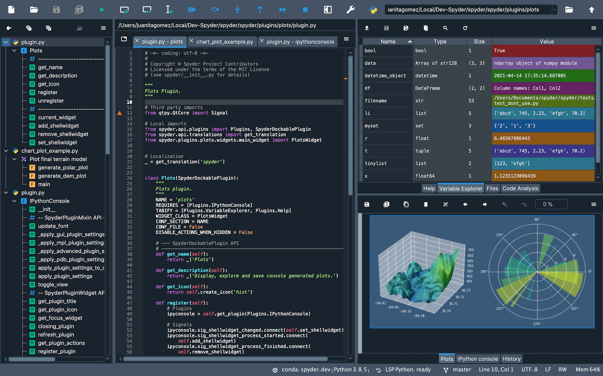

# Writing and running Python code
{: .no_toc }


<p align="center">

</p>


## Contents
{: .no_toc }

<details open markdown="block">
  <summary>
    Table of contents
  </summary>
  {: .text-delta }
- TOC
{:toc}
</details>

---
## Introduction
To write Python code in a terminal or command line, you can use a text editor like [Notepad++](https://notepad-plus-plus.org/downloads/) 
or [Sublime Text](https://www.sublimetext.com/).

Simply create a new file, add your Python code, and save it with a *.py* extension. 
Then, you can run the code by typing ```python``` followed by the name of the file in the terminal or command line. 
For example, if your file is named "hello.py", you can run it by typing "python hello.py" in the terminal.


Once you are comfortable with writing Python code in a terminal or command line, you can move on to using an Integrated Development Environment (IDE) or Notebooks. 
Below, you will find a description of each of these tools, along with reccomendations.

## Python IDEs
*Integrated Development Environments* (IDEs) are software that wraps all the tools needed for writing and testing 
 programs in a single toolkit. IDEs are more advanced than *code editors* (CEs), which are lightweight amd usually
only contain tools to write code (e.g., a text editor with syntax highlighting and simple bug catching). We recommend
using an IDEs when writing, debugging and testing your code, as it will make your life way simpler.

Many online guides exist to choose IDEs (e.g., [this one](https://www.educative.io/blog/best-python-ides-ce-2021), or 
[this other one](https://www.simplilearn.com/tutorials/python-tutorial/python-ide)). Here, you will just find a (non-extensive)
collection of selected IDEs that might be for you. This might help you find the right IDEs, matching your personal taste and needs.

<details close markdown="block">
  <summary>
    Expand selected IDEs
  </summary>

### Visual Studio Code
[Visual Studio Code](https://code.visualstudio.com/) (VS Code) is a full-featured code editor available for Linux, Mac OS X, and Windows. 
It is small and light-weight, but full-featured, as well as open-source, extensible, and configurable for almost any task.
VS Code is full-featured despite having a small footprint. One of our favourites IDEs for Python. 


### PyCharm
[PyCharm](https://www.jetbrains.com/pycharm/) is the de facto Python IDE environment, with a big community support. It is fully featured
and is available for Linux, Mac OS X, and Windows. It is available in both paid (Professional) and free (Community) editions, 
although the community edition might be somewhat limited for advanced tasks. Free educational licenses are available
for the Professional edition upon request. Also among our favourite IDEs!


### Spyder
[Spyder](https://www.spyder-ide.org/) is an open-source Python IDE that’s optimized for data science and analysis. 
Spyder comes included with the Anaconda package manager distribution, so you might have already installed it on your computed.
Spyder integrates well with common Python data science libraries like SciPy, NumPy, and Matplotlib. A special feature
of Spyder is a “variable explorer” that allows you to display data using a table-based layout right inside your IDE. 
Overall, it is a more specialized IDE compared to the previous ones, that might be very suited for data science but not 
necessarily for other coding tasks. 



</details>

## Interactive notebooks

Interactive notebooks are a type of document that allows users to combine live code, narrative text, equations, 
visualizations, and other media into a single executable document. This format allows users to experiment with code, 
visualize data, and share their work with others. Python has several popular interactive notebook options, with Jupyter 
Notebooks and Google Colab being two of the most widely used.

### Jupyter Notebooks 
Jupyter Notebooks is a popular open-source web application that allows users to create and share interactive 
notebooks with live code, equations, visualizations, and narrative text. Jupyter Notebooks support multiple 
programming languages, including Python, R, Julia, and more. They are commonly used in data analysis, 
scientific computing, and education.

With Jupyter Notebooks, users can write code in cells, execute it, and see the output within the notebook. 
This allows for an iterative and interactive development process, where users can modify and test their code in 
real-time. Users can also create visualizations, include documentation, and collaborate with others by sharing their 
notebooks.

### Google Colab
Google Colab is a cloud-based version of Jupyter Notebooks that is provided by Google. It allows users 
to create and share interactive notebooks using Google's cloud infrastructure. Google Colab supports Python 2 and 3 
and offers a range of pre-installed libraries for data analysis, machine learning, and more. Google Colab also allows 
users to import and export notebooks from Jupyter Notebooks.

One of the advantages of Google Colab is that it provides free access to GPUs and TPUs, which can significantly speed 
up computations for machine learning and other applications. Google Colab also allows users to collaborate in real-time, 
making it an ideal platform for group projects and online courses.

## Pros and Cons of IDEs vs Interactive Notebooks 

**IDEs**

*Pros*:
- Code completion and syntax highlighting can help improve productivity and reduce errors.
- Debugging tools can help identify and fix issues in code.
- Many IDEs offer integration with version control systems like Git, making it easy to collaborate with others.
- IDEs often offer a more advanced development environment than simple text editors or command-line interfaces.

*Cons*:
- IDEs can be more complex and take longer to learn than simpler development tools.
- IDEs may not be suitable for all projects, especially smaller or simpler ones.
- Some IDEs can be resource-intensive and slow down older or less powerful computers.

**Interactive notebooks**

*Pros*:
- Interactive notebooks allow for an iterative and interactive development process, where users can modify and test their code in real-time.
- Notebooks can combine live code, narrative text, equations, visualizations, and other media into a single executable document, making it easy to explore data and communicate results.
- Notebooks can be shared easily, making it ideal for collaboration and education.
- Cloud-based notebooks like Google Colab provide free access to powerful hardware resources like GPUs and TPUs, which can speed up computations.

*Cons*:
- Notebooks can be less efficient for large or complex projects than more traditional development environments like IDEs.
- Notebooks can be less suitable for projects that require a more modular or object-oriented approach to development.
- Notebooks can be less suitable for version control than more traditional development environments, which can make it difficult to track changes over time.

In summary, IDEs and interactive notebooks each have their own set of pros and cons. IDEs offer more advanced development environments, while interactive notebooks allow for an iterative and interactive development process. The choice between an IDE or an interactive notebook depends on the specific needs of the project, and many developers use a combination of both depending on the task at hand.
## Additional resources


<sub>Copyright &copy; 2023 Francesca Grisoni. Distributed by an [MIT licence](LICENSE).</sub>
