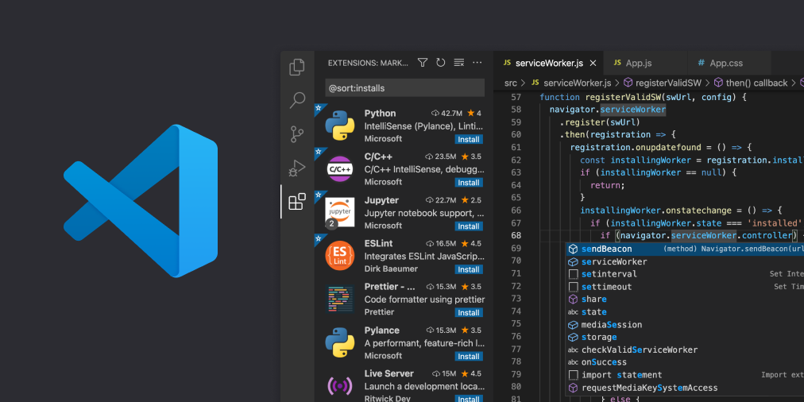
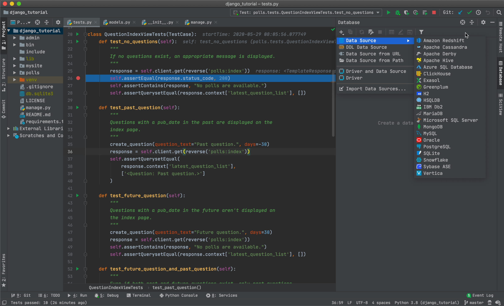
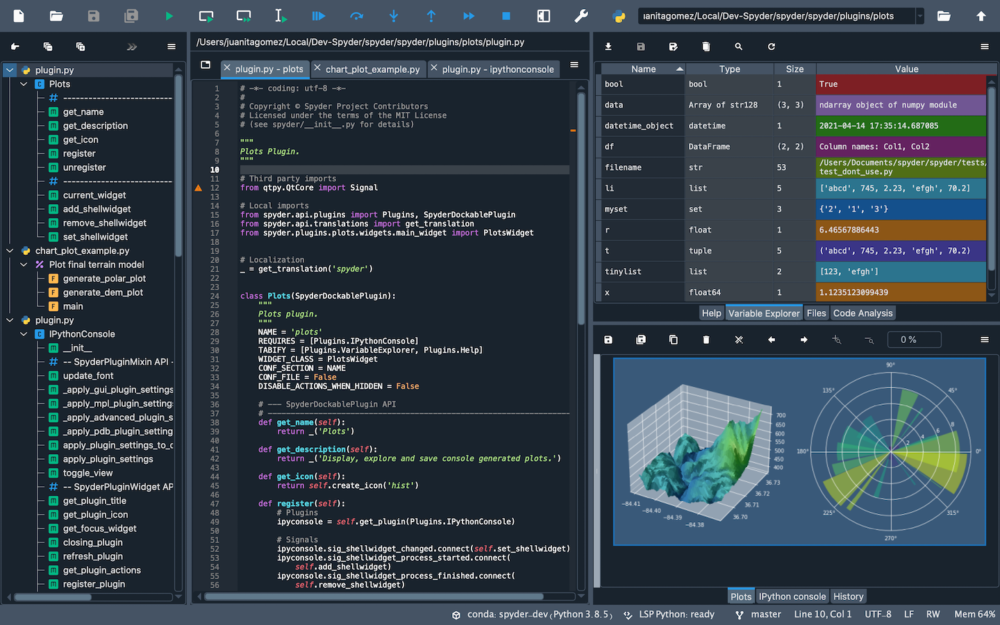

# Useful tools and packages for the data analyst
{: .no_toc }

> *Make sure that you always have the right tools for the job. It's no use trying to eat a steak with a teaspoon, and a straw.*
> 
> Anthony T. Hincks

Image credits [Wikimedia Commons](https://commons.wikimedia.org/wiki/File:Old_tools_collection_%2827204177988%29.jpg)

 
## Contents
{: .no_toc }

  

    Table of contents
  

  {: .text-delta }
- TOC
{:toc}

---

## Python IDEs
*Integrated Development Environments* (IDEs) are software that wraps all the tools needed for writing and testing 
 programs in a single toolkit. IDEs are more advanced than *code editors* (CEs), which are lightweight amd usually
only contain tools to write code (e.g., a text editor with syntax highlighting and simple bug catching). We recommend
using an IDEs when writing, debugging and testing your code, as it will make your life way simpler.

Many online guides exist to choose IDEs (e.g., [this one](https://www.educative.io/blog/best-python-ides-ce-2021), or 
[this other one](https://www.simplilearn.com/tutorials/python-tutorial/python-ide)). Here, you will just find a (non-extensive)
collection of selected IDEs that might be for you. This might help you find the right IDEs, matching your personal taste and needs.

  

    Expand selected IDEs
  

### Visual Studio Code
[Visual Studio Code](https://code.visualstudio.com/) (VS Code) is a full-featured code editor available for Linux, Mac OS X, and Windows. 
It is small and light-weight, but full-featured, as well as open-source, extensible, and configurable for almost any task.
VS Code is full-featured despite having a small footprint. One of our favourites IDEs for Python. 

### PyCharm
[PyCharm](https://www.jetbrains.com/pycharm/) is the de facto Python IDE environment, with a big community support. It is fully featured
and is available for Linux, Mac OS X, and Windows. It is available in both paid (Professional) and free (Community) editions, 
although the community edition might be somewhat limited for advanced tasks. Free educational licenses are available
for the Professional edition upon request. Also among our favourite IDEs!

### Spyder
[Spyder](https://www.spyder-ide.org/) is an open-source Python IDE that’s optimized for data science and analysis. 
Spyder comes included with the Anaconda package manager distribution, so you might have already installed it on your computed.
Spyder integrates well with common Python data science libraries like SciPy, NumPy, and Matplotlib. A special feature
of Spyder is a “variable explorer” that allows you to display data using a table-based layout right inside your IDE. 
Overall, it is a more specialized IDE compared to the previous ones, that might be very suited for data science but not 
necessarily for other coding tasks. 

## Virtual environments

## Python libraries for data science
### Math

**SciPy**

**NumPy**

### Data exploration

**Pandas**

**D-tale**

### Data visualization
**Matplotlib**

**Plotly**

**Seaborn**

**Ggplot**

### Machine learning

**SciKit-Learn**

**PyCaret**

**Keras**

**TensorFlow**

**PyTorch**

### Web data scraping
**Scrapy**

**BeautifulSoup**

You will find more info [here](https://www.knowledgehut.com/blog/data-science/python-libraries-for-data-science).

Copyright &copy; 2023 Francesca Grisoni. Distributed by an [MIT licence](LICENSE).
