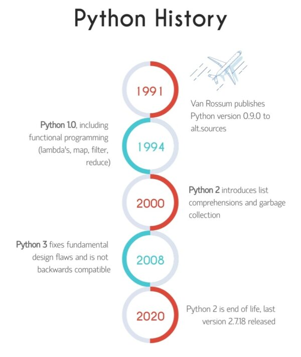

# Writing Good Python code
{: .no_toc }

  

    Table of contents
  

  {: .text-delta }
- TOC
{:toc}

---

## Python PEP8 Style

https://peps.python.org/pep-0008/

Copyright &copy; 2023 Francesca Grisoni. Distributed by an [MIT licence](LICENSE).
